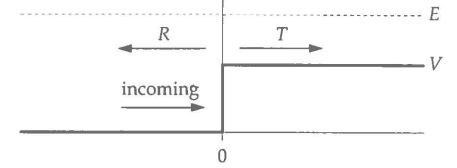

## Exercise 2.5: Quantum potential step

A well-known quantum mechanics problem involves a particle of mass m that encounters a one-dimensional potential step, like this:

The particle with initial kinetic energy E and wavevector $ k_1 = \sqrt{2mE}/\hbar$ enters from the left and encounters a sudden jump in potential energy of height V at position $x = 0$. By solving the Schrtidinger equation, one can show that when $E > V$ the particle may
either (a) pass the step, in which case it has a lower kinetic energy of $E - V$ on the other side and a correspondingly smaller wavevector of $k_2 = \sqrt{2m(E - V)}/\hbar$, or (b) it may be reflected, keeping all of its kinetic energy and an unchanged wavevector but moving
in the opposite direction. The probabilities T and R for transmission and reflection are given by
$$ T = \frac{4k_1k_2}{(k_1 + k_2)^2}, \quad \quad R = \bigg(\frac{k_1 - k_2}{k_1 + k_2}\bigg)^2. $$

Suppose we have a particle with mass equal to the electron mass $m = 9.11 \times 10^{-31} kg$ and energy $10eV$ encountering a potential step of height $9eV$. Write a Python program to compute and print out the transmission and reflection probabilities using the formulas above.

**(But instead of printing values for a single energy, please calculate the transmission and reflection probabilities $(T \amp R)$ for a range of electron energies E from 9 to 40 eV, and plot the results for T and R as a function of E.
Make sure to label your axes.)**
